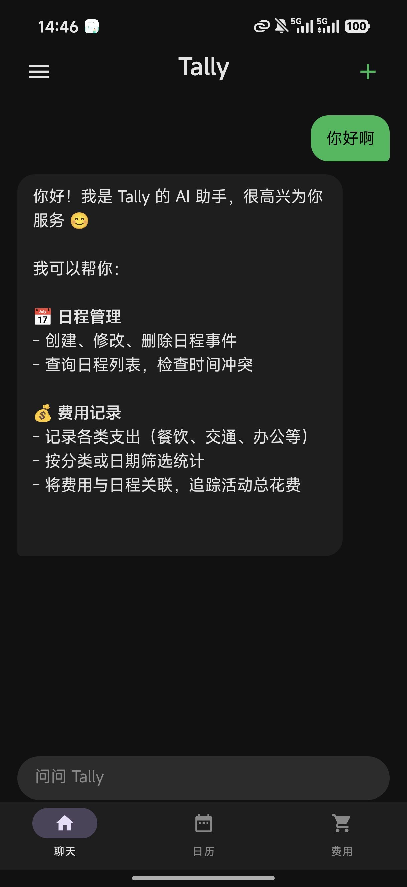
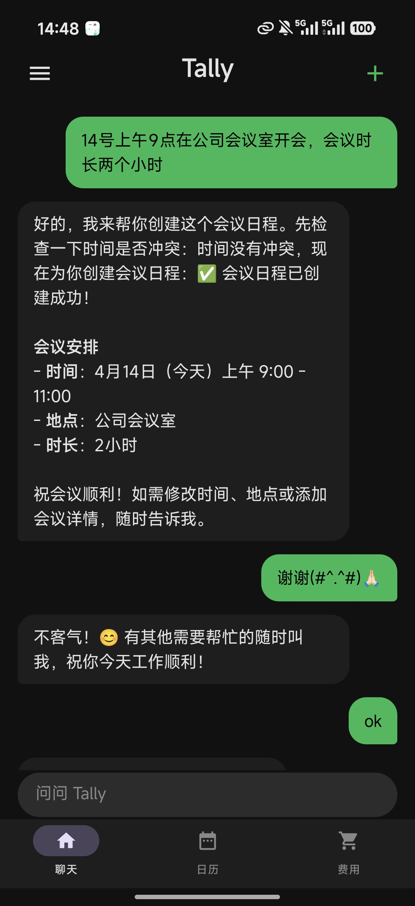
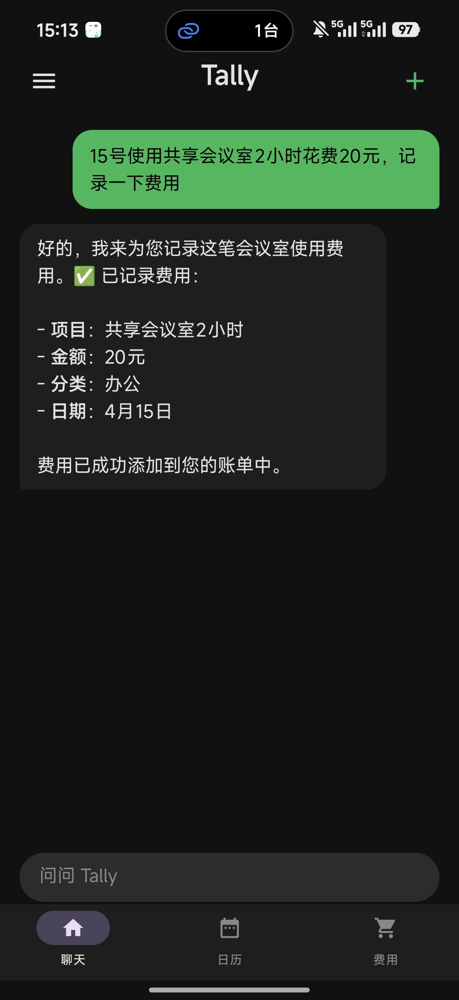
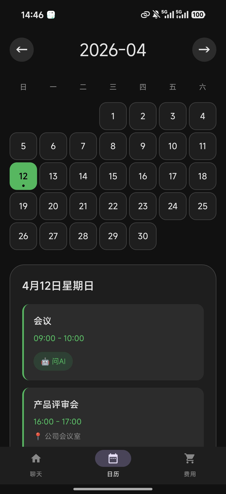
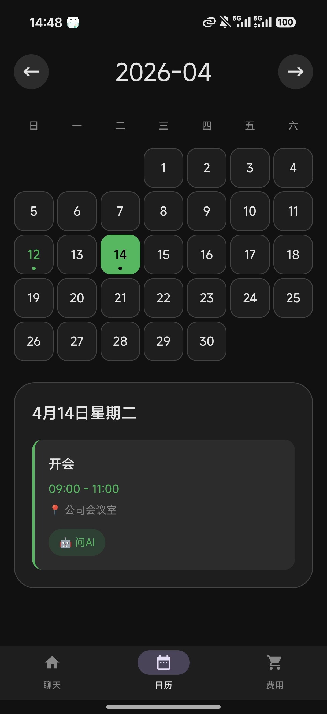
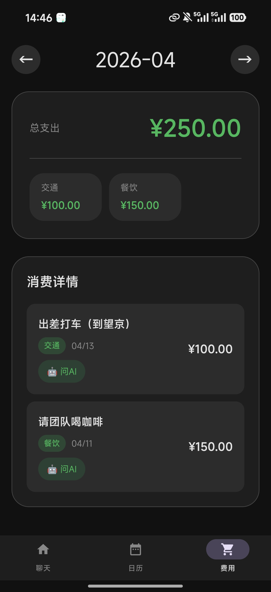

# Tally（对位）

> AI 驱动的 Android 日程 + 费用管理 App


---

## 项目简介

Tally 是一款 **AI 原生 Android 应用**，用户通过自然语言对话即可完成日程创建、冲突检测、费用记录与关联。后端基于 **Multi-Agent 架构**，使用月之暗面 Kimi-k2.5 模型，通过 Vercel AI SDK 的 `streamText(maxSteps=5)` 实现多步工具链式调用，支持流式实时响应。前端使用 Jetpack Compose 构建聊天界面，嵌套 React WebView 展示结构化的日历和费用视图，通过 `@JavascriptInterface` 实现 Native ↔ WebView ↔ AI 三层跨层通信。项目已在小米 17 真机完成端到端验证，后端部署至阿里云 ECS。

**核心能力**：Multi-Agent 链式工具调用 · 流式 SSE 响应 · WebView 跨层通信 · 真机端到端验证

---

## 应用截图

<table>
  <tr>
    <td align="center"><b>AI 助手欢迎界面</b></td>
    <td align="center"><b>自然语言创建日程</b></td>
    <td align="center"><b>自然语言记录费用</b></td>
  </tr>
  <tr>
    <td></td>
    <td></td>
    <td></td>
  </tr>
  <tr>
    <td align="center"><b>月历视图（含日程）</b></td>
    <td align="center"><b>日历即时同步新日程</b></td>
    <td align="center"><b>费用汇总 + 分类统计</b></td>
  </tr>
  <tr>
    <td></td>
    <td></td>
    <td></td>
  </tr>
</table>

---

## 系统架构

```
┌──────────────────────────────────────────────────────────────┐
│                     Android App（Kotlin）                      │
│                                                              │
│  ┌──────────────┐  ┌────────────────┐  ┌───────────────┐    │
│  │  ChatScreen  │  │  CalendarView  │  │  ExpenseView  │    │
│  │  (Compose)   │  │   (WebView)    │  │   (WebView)   │    │
│  └──────┬───────┘  └───────┬────────┘  └───────┬───────┘    │
│         │                  └───────────────────┘             │
│         │           TallyJsBridge (@JavascriptInterface)      │
│  ChatViewModel ◄─────────────────┘                           │
│  (StateFlow)    TallyApiClient（OkHttp 流式 SSE）              │
└─────────┼────────────────────────────────────────────────────┘
          │ POST /api/chat（Vercel AI Data Stream 协议）
          │
┌─────────▼────────────────────────────────────────────────────┐
│                Backend（Node.js + TypeScript）                 │
│                                                              │
│  ┌──────────────────────────────────────────────────────┐   │
│  │              Orchestrator Agent                        │   │
│  │    streamText(maxSteps=5, tools=[子 Agent 工具])        │   │
│  └──────────────┬───────────────┬────────────────────────┘   │
│                 │               │                             │
│  ┌──────────────▼────┐  ┌───────▼────────────────────┐      │
│  │  Schedule Agent   │  │     Expense Agent           │      │
│  │  · createEvent    │  │  · createExpense            │      │
│  │  · listEvents     │  │  · listExpenses             │      │
│  │  · updateEvent    │  │  · linkExpenseToEvent       │      │
│  │  · deleteEvent    │  │  · listExpensesByEvent      │      │
│  │  · checkConflict  │  └──────────────┬──────────────┘      │
│  └──────────┬─────── ┘                 │                     │
│             └──────────────┬───────────┘                     │
│  ┌─────────────────────────▼────────────────────────────┐   │
│  │           PostgreSQL 16（Docker）                      │   │
│  │    events · expenses · event_expense_links            │   │
│  └────────────────────────────────────────────────────────┘  │
│  kimiCompatFetch 拦截器（注入 reasoning_content 占位符）       │
└──────────────────────────────────────────────────────────────┘
          │
   月之暗面 Kimi API · kimi-k2.5（OpenAI-compatible）
```

---

## 技术栈

### Android 客户端

| 技术 | 版本 | 用途 |
|------|------|------|
| Kotlin | 1.9.22 | 主开发语言 |
| Jetpack Compose | BOM 2024.02.00 | 声明式 UI |
| Material 3 | — | 深色主题（#111111 + 品牌绿 #1DB954） |
| Jetpack Navigation | 2.7.6 | 三 Tab 路由管理 |
| ViewModel + StateFlow | 2.7.0 | 响应式状态管理 |
| OkHttp | 4.12.0 | 流式 SSE HTTP 客户端 |
| DataStore + Gson | 1.0.0 / 2.10.1 | 会话历史持久化 |
| androidx.webkit | 1.12.1 | WebView 增强 |
| Min SDK | API 26 | Android 8.0+ |

### 后端服务

| 技术 | 版本 | 用途 |
|------|------|------|
| Node.js + TypeScript | 5.3.3 | 主开发语言 |
| Express | 4.18.2 | HTTP 服务框架 |
| Vercel AI SDK | 4.3.15 | streamText + 工具调用编排 |
| @ai-sdk/openai | 1.3.22 | OpenAI-compatible 适配器（接 Kimi） |
| Kimi-k2.5 | — | 月之暗面推理型大模型 |
| @tavily/core | 0.7.2 | 联网搜索工具 |
| pg | 8.11.3 | PostgreSQL 原生客户端 |
| Docker + Nginx | — | 容器化部署 + 反向代理 |

### WebView UI

| 技术 | 版本 | 用途 |
|------|------|------|
| React | 18.3.1 | 日历 / 费用视图 |
| TypeScript | 5.6.3 | 类型安全 |
| Vite | 6.0.6 | 构建工具（IIFE 模式，兼容 Android WebView） |

---

## 核心功能

| 功能 | 描述 |
|------|------|
| 💬 **自然语言对话** | 用中文描述日程和费用，AI 自动解析时间、金额、关联关系 |
| 📅 **智能日程管理** | 新建、修改、删除日程；自动检测时间冲突并提示 |
| 💰 **费用追踪** | 记录消费并关联至具体日程事件（如出差报销） |
| 🔍 **联网搜索** | Tavily API 查询实时信息，自动创建日程 |
| 📊 **日历 / 费用视图** | WebView 月历网格 + 费用列表，点击条目自动跳转 AI 对话 |
| 🌊 **流式实时响应** | AI 回复字符级流式显示，体验接近 ChatGPT |
| 💾 **会话历史持久化** | DataStore + Gson，App 重启后历史不丢失 |
| 🚀 **公网部署** | 后端已部署至阿里云 ECS，Nginx 反向代理 + 限流 |

---

## Demo 场景（Agent 能力边界验证）

| # | 用户输入 | Agent 调用链 | 体现能力 |
|---|---------|-------------|---------|
| 1 | "4月18号，我要去参加AI研讨会，帮我记录" | `createEvent` | 单步工具调用，时间解析 |
| 2 | "帮我查北京车展是什么时候，提前两天到北京" | 联网搜索 → `createEvent` | 知识检索 + 推理 + 工具调用 |
| 3 | "下礼拜一清空所有行程，帮我请假" | `listEvents` → `deleteEvent` × N | **多步调用，动态决策工具次数** |
| 4 | "明天看一下我什么时间有空，安排业务规划会" | `listEvents` → `checkConflict` → `createEvent` | **3步链式推理，冲突感知** |
| 5 | "出差代驾200块，帮我记录并关联出差行程" | `createExpense` → `linkExpenseToEvent` | 跨域 Agent 协作（费用+日程） |
| 6 | "今天给团队买咖啡花了150，帮我记一下" | `createExpense` | 费用域单步，金额自然语言解析 |

> **场景 3、4 是核心压力测试**：场景 3 要求 Orchestrator 动态决策调用次数；场景 4 是三步依赖链，每步输出作为下一步输入。两个场景的稳定运行直接依赖 kimi-k2.5 兼容性攻坚成果。

---

## 工程技术亮点

### 亮点 1：kimi-k2.5 多步工具调用兼容性攻坚

**问题**：Vercel AI SDK `streamText(maxSteps=N)` 重建消息历史时，kimi-k2.5 要求的 `reasoning_content` 字段丢失，导致 HTTP 400。空字符串同样触发 400，必须非空占位符。

**解决**：自定义 `kimiCompatFetch` 拦截器，在 fetch 层注入占位符：

```typescript
// backend/src/agents/kimiClient.ts
const kimiCompatFetch: FetchFunction = async (url, options) => {
  const body = JSON.parse(options.body as string);
  body.messages = body.messages.map((msg: Message) => {
    if (msg.role === "assistant" && !msg.reasoning_content) {
      return { ...msg, reasoning_content: "." };
    }
    return msg;
  });
  return fetch(url, { ...options, body: JSON.stringify(body) });
};
```

**验证**：`checkConflict → createEvent`（2步）、`listEvents → deleteEvent × N`（N+1步）稳定运行。

---

### 亮点 2：Android WebView ES Module 兼容性

**问题**：Vite 默认生成 `type="module" crossorigin` 的 script 标签，在 Android WebView + WebViewAssetLoader 下白屏无报错。

**解决**（三步组合）：① Vite plugin 去除 `type="module"` 和 `crossorigin`，改为 `defer` 普通脚本；② 构建改为 IIFE 格式；③ 开启 `MIXED_CONTENT_ALWAYS_ALLOW`。

---

### 亮点 3：WebView Bridge 跨层通信

```
WebView JS（React）
  └─ window.TallyBridge.openChat(msg)
       └─ @JavascriptInterface（TallyJsBridge.kt）
            └─ Handler(Looper.getMainLooper()).post { }   ← 必须切回主线程
                 └─ chatViewModel.prefillMessage(msg)
                      └─ navController.navigate("chat")
```

---

### 亮点 4：WSL2 真机调试网络隔离突破

```
手机 → ADB 反向隧道（Windows PowerShell）→ Windows localhost → WSL2 桥接 → 后端（0.0.0.0）
```

`adb reverse` 必须在 Windows 端执行，后端监听 `0.0.0.0` 而非 `127.0.0.1`。

---

## 开发进度

| 阶段 | 内容 | 状态 | 关键交付物 |
|------|------|:----:|-----------|
| Phase 1 | 后端基础架构 | ✅ | PostgreSQL 4张表、Express API、docker-compose |
| Phase 2 | Agent 核心 | ✅ | Kimi 集成、Schedule/Expense 9个工具、流式接口 |
| Phase 3 | Android 聊天界面 | ✅ | OkHttp 流式客户端、Compose ChatScreen、真机联调 |
| Phase 4 | WebView 日历/费用 | ✅ | React + Vite UI、WebView Bridge、三 Tab 导航 |
| Phase 5 | 集成与打磨 | ✅ | 6个 Demo 场景真机验证、键盘/导航栏修复、会话持久化 |
| Phase 6 | 阿里云部署 | ✅ | ECS 部署、Nginx 安全配置、公网访问验证 |

**开发周期**：2026-04-03 ～ 2026-04-14，约 12 天

---

## 代码统计

| 模块 | 语言 | 文件数 | 代码行数 | 主要职责 |
|------|------|:------:|:-------:|---------|
| Android 客户端 | Kotlin | 11 | 1,657 | Compose UI、OkHttp 流客户端、ViewModel、WebView 桥接 |
| 后端服务 | TypeScript | 16 | 1,203 | Multi-Agent Orchestrator、领域工具、REST API、DB 层 |
| WebView UI | TypeScript/TSX | 6 | 452 | React 日历视图、费用视图、API 通信层 |
| **合计** | — | **33** | **3,312** | — |

---

## AI 辅助开发说明

本项目使用 **Claude Code** 作为主要 AI 辅助开发工具，整合三种模型协同完成不同类型任务。

### 模型使用分工

| 模型 | 使用占比 | 主要用途 |
|------|:--------:|---------|
| Claude Sonnet 4.6 | ~40% | 架构设计、Agent 逻辑、复杂推理、集成排查 |
| Kimi-k2.5（月之暗面） | ~40% | 后端 Agent 运行时调用（App 功能本身） |
| Claude Haiku 4.5 | ~20% | UI 组件生成、脚手架、文档更新 |

> Kimi-k2.5 同时扮演两个角色：**开发辅助**（Claude Code 任务分配）和 **App 运行时**（Multi-Agent 推理引擎）。

---

### Token 消耗统计（完整项目，来自 Claude Code 实际记录）

统计时间：2026-04-03 ～ 2026-04-14，共 **2,529 次 API 调用**。

#### Claude Sonnet 4.6（两个部署版本合并）

| 计费项 | Token 数 | 单价（OpenRouter） | 费用 |
|--------|----------:|------------------:|-----:|
| 普通输入 | 69,238 | $3.00 / M | $0.21 |
| 输出 | 606,709 | $15.00 / M | $9.10 |
| 缓存写入 | 11,517,300 | $3.75 / M | $43.19 |
| 缓存读取 | 82,504,682 | $0.30 / M | $24.75 |
| **API 小计** | | | **$77.25** |
| OpenRouter 充值手续费（+8%） | | | +$6.72 |
| **实际支付** | | | **$83.97** |

#### Claude Haiku 4.5（两个部署版本合并）

| 计费项 | Token 数 | 单价（OpenRouter） | 费用 |
|--------|----------:|------------------:|-----:|
| 普通输入 | 3,035 | $0.80 / M | $0.00 |
| 输出 | 60,807 | $4.00 / M | $0.24 |
| 缓存写入 | 1,578,763 | $1.00 / M | $1.58 |
| 缓存读取 | 15,472,634 | $0.08 / M | $1.24 |
| **API 小计** | | | **$3.06** |
| OpenRouter 充值手续费（+8%） | | | +$0.27 |
| **实际支付** | | | **$3.33** |

#### Kimi-k2.5（月之暗面官方账单，实际扣费）

以下数据来自月之暗面开放平台「计费明细 - 日账单」，为实际扣款金额：

| 日期 | 实际消费（¥） |
|------|-------------:|
| 2026-04-07 | ¥1.04 |
| 2026-04-08 | ¥15.34 |
| 2026-04-09 | ¥1.82 |
| 2026-04-10 | ¥15.04 |
| 2026-04-11 | ¥17.05 |
| 2026-04-12 | ¥0.02 |
| 2026-04-13 | ¥1.68 |
| **合计** | **¥51.99** |

> 统计区间 2026-04-07 ～ 2026-04-13（平台日账单数据）。

---

### 资费总汇总

| 模型 | 实际支付 | 备注 |
|------|--------:|------|
| Claude Sonnet 4.6 | $83.97 | 含 OpenRouter 8% 充值手续费 |
| Claude Haiku 4.5 | $3.33 | 含 OpenRouter 8% 充值手续费 |
| Kimi-k2.5 | ¥51.99 ≈ $7.17 | 月之暗面平台账单实际扣费，汇率 ¥7.25/$ |
| **项目总费用** | **≈ $94.47 USD** | **≈ ¥685 RMB** |

> **缓存节省分析**：若无 Claude Code prompt cache 机制，Claude 部分费用将从 $87.30 膨胀至 $292.88，**缓存节省 $205.58（70.2%）**。缓存命中的 token 按折扣价计费（缓存读取为正常输入价格的 1/10），有效控制了大量重复上下文的成本。
>
> **全项目 token 总流量：231.2M tokens（2,529 次 API 调用）**

---

## 项目目录结构

```
Tally/
├── android/                            # Android 客户端（Kotlin + Compose）
│   └── app/src/main/kotlin/com/tally/app/
│       ├── MainActivity.kt             # Edge-to-edge + windowInsets 配置
│       ├── data/
│       │   ├── remote/TallyApiClient.kt        # OkHttp 流式 SSE 客户端
│       │   └── repository/ChatSessionRepository.kt  # DataStore 持久化
│       ├── ui/chat/ChatScreen.kt               # Gemini 风格聊天界面
│       └── navigation/
│           ├── NavGraph.kt                     # 3-Tab Scaffold
│           └── TallyJsBridge.kt                # @JavascriptInterface 桥接
│
├── backend/                            # Node.js + TypeScript 后端
│   └── src/
│       ├── agents/
│       │   ├── kimiClient.ts           # Kimi 兼容适配器（kimiCompatFetch）
│       │   └── orchestrator.ts         # Multi-Agent 协调器
│       ├── domains/
│       │   ├── schedule/               # 日程域（5个工具）
│       │   └── expense/                # 费用域（4个工具）
│       └── api/routes/                 # REST API（chat/events/expenses/health）
│
├── webview-ui/                         # React + Vite WebView UI
│   └── src/
│       ├── views/CalendarView.tsx      # 月历网格（24px 圆角）
│       └── views/ExpenseView.tsx       # 费用列表 + 汇总
│
└── screenshots/                        # App 真机截图
```

---

## 本地开发启动

```bash
# 1. 后端
cd backend && cp .env.example .env   # 填入 KIMI_API_KEY / TAVILY_API_KEY / DATABASE_URL
docker compose up -d                  # 启动 PostgreSQL
npm run migrate && npm run dev        # 迁移 + 启动（port 3000）

# 2. Android 真机（Windows PowerShell）
adb reverse tcp:3000 tcp:3000
# WSL 编译
cd android && ./gradlew assembleDebug
adb install -r app/build/outputs/apk/debug/app-debug.apk

# 3. WebView UI（可选，已预构建）
cd webview-ui && npm install && npm run build
```

---

## License

MIT © 2026 Tally Dev
